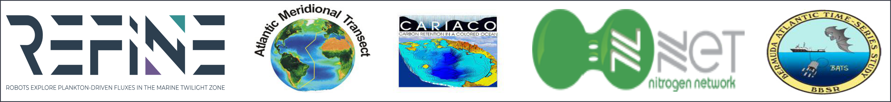
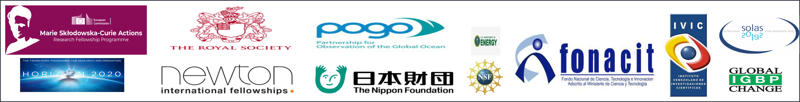

## [RAFAEL RASSE (under construction)](+)    

#### Integrative Perspective of the Biogeochemical Cycles
> 
 I am a chemist with pluridisciplinary skills, who holds a PhD in Chemistry (Earth Science), a Postgraduate Certificate in Ocean Observatories. My solid multidisciplinary background and skills allow me to have a wide understanding, and an exceptional integrative view regarding: (1) how several mechanisms concurrently drive the biogeochemical cycles of key elements in the main reservoirs of the planet (i.e. atmosphere, land, ocean and rivers), and (2) how such cycles are interconnected within (and between) the reservoirs and partially drive the Earth’s climate, and (3) identify key biogeochemical knowledge gaps and ultimately propose novel solutions to fill them by combining traditional and ground-breaking cross-disciplinary approaches particularly in the tropical oceans poorly oxygenated. 

#### General Topic of Research ####
> 
 Investigating the biogeochemical cycles of carbon and nitrogen in the main Earth’s reservoirs by combining conventional and revolutionary approaches of quantification. 

#### Career Goal
> 
 Contributing to unravel the key set of mechanisms that concurrently modulate the carbon, oxygen, and nitrogen cycles in OMZs and anoxic basins to ultimately contribute to refine their mechanistic predictions. 

#### Multidisciplinary individual projects 
 - Marie Sklodowska-Curie Fellowship. Key factors driving particulate organic matter fluxes and related dinitrogen losses in the main anoxic oxygen minimum zones of the world oceans (Noceanic). Award Period: 2019-2021. ***PI: R. Rasse***. France.  
 - Royal society. Autonomous observations of oceanic carbon fluxes in the oxygen minimum zones (Atlantic OMZ). Award Period: 2016-2018. ***PI: R. Rasse***. UK.
 - Monitoring seasonal changes of carbonate chemistry off tropical coasts: implications for emissions of CO2 to the atmosphere.Sponsor: Venezuelan Institute for Scientific Research. Award Period:(2015, cancelled). ***PI:R. Rasse***. Venezuela

#### Pluridisciplinary Research-Programmes
 -  REFINE. Robots explore plankton-driven fluxes in the marine twilight zones. PI: H. Claustre. Award Period: 2019-2023. [Website](https://erc-refine.eu/new/) 
 - The Atlantic Meridional Transect (AMT) multidisciplinary programme, which undertakes biological, chemical and physical oceanographic research during an annual voyage between the UK and destinations in the South Atlantic.PI:A. Rees.2014-2016. [website](https://www.amt-uk.org/) 
 -  Nitrogen cycling in Latin America: drivers, impacts and vulnerabilities (CRN 3005). Sponsor: Inter-American for Global Change Research. PIs: J. Ometto (PI), T. Pérez (Co-PI), and others. Award Period: 2012-2017. [Website](http://nitrogen.ccst.inpe.br/)  
 -  Cariaco Basin Time Series. Climatic and Oceanographic Changes in the system of the Cariaco Basin. Sponsor: National Fund for Science and Technology (FONACIT-MCTI No 201200404). PIs:I. Astor (PI), T. Pérez (Co-PI), and others. Award Period: 2012-2015. [Website](http://www.imars.usf.edu/cariaco) 
 -	Bermuda Atlantic Time Series (BATS). This is a long-term oceanographic study by the Bermuda Institute of Ocean Sciences (BIOS).2010-2011. [Website](http://bats.bios.edu/about/)  
  

#### Cross-Disciplinary International Trainings 
- On-board training on an Atlantic Meridional Transect (AMT) cruise. Royal Research Ship James Clark Ross and Plymouth Marine Laboratory, UK. 2014.
- Pan-American Advanced Studies Institute (PASI) Programme “Toward a Sustained Operational River-to-Shelf Observation & Prediction System for the Amazon. Brazil. 2013.
- Nippon Foundation-Partnership for Observation of the Global Ocean (NF-POGO) Centre of Excellence in Observational Oceanography (CoFe). Bermuda. 2011.
- Third Surface Ocean Lower Atmosphere (SOLAS) Study. France.2007.

 

#### Graduate Courses (> 40 credits, Period: 2007-2012)

 - ***Earth Science*** 
   - Introduction to Environmental Sciences 
   - Climate Change: Causes, Effects, and Mitigation 
   - Surface Ocean Lower Atmosphere Summer School 
   - Atmospheric Chemistry 
   - Effects of Global Change on the Terrestrial Biosphere 
   - Chemical, Physical, and Biological Oceanography 
   - Ocean Colour/Satellite Observatories 
   - Moored Observatories 
   - Ecological Modelling
   - Ocean Data Management 
   - Carbon Cycle/Ocean Acidification
       
  - ***Chemistry***
     - Analytical Chemistry
     - Advanced Inorganic Chemistry 
     - Chemical Kinetics 
     - Chemical Thermodynamics

#### Skills by Topics ####
My skills varied according to the Earth’s reservoir studied as described below:

 ***Ocean-Sea*** 
   -	Exploiting and merging standard and new generation of Biogeochemical Argo floats (ground-breaking approach) and remote sensing data products  to explore and  investigate remote oceanic regions in the tropics. 
   -	Using CTD-rosette to study the biogeochemical and optical characteristics of the surface and mesopelagic layer of the ocean.
   	
 ***Atmosphere***. Applicating high volume cascade impactor, only-wet deposition sampler, meteorological station, and satellite products (i.e. backward air-masses trajectories) to investigate.
 
 ***Rivers***. Automatic pumping sampler, multiparametric ultrasound, general Oceanic speedometer, and satellite products on the rivers’ basins (i.e. precipitation)
 
 ***Land***. Closed chamber methods to collect and then measure greenhouse gases emitted from corn fields via gas chromatography (i.e. CO2 & N2O) .

#### Instruments in the Lab ####
-	Technicon Auto-Analyzer II to analyse macronutrients.
-	UV combustion system to convert dissolved organic matter into dissolved inorganic ions. 
-	Gas chromatography to quantify dissolved organic matter and ions, and gases (CO2 & N2O ) 
-	CHN analyser  to quantify particulate organic matter.
-	Automatic titration to determine alkalinity  and investigate carbonate chemistry in rivers and seawater.

#### Deployment of biogeochemical (BGC) Argo floats, field work, and cruise expeditions ####
> 
 Since the begging of my career, I have been leading and participating in field works to investigate biogeochemical cycles in the main reservoirs of the planet (i.e. land, ocean, rivers, and atmosphere) from local, regional, and global scales and over a continuum of time scales (from days to years). More recently, I have been involved in the deployment of BGC-Argo floats.
   

***Deployment of BGC-Argo floats in the tropical OMZs***
> 
 Since 2014, I have been directly involved in coordinating the deployment of the first BGC-Argo floats in the OMZs of the eastern tropical north Atlantic and north Pacific. More recently (2020), I have deployed the first float attached with an UVP and an array of sensors that will allow me to generate key information regarding how diverse mechanisms modulate the cycles of C, O, and N. 

 

***Field work, and cruise expeditions***
-	Atlantic Meridional Transect (AMT) 24 and 26. (80 days)
> 
 Activities. AMT24: Collecting suspended POM in the surface and mesopelagic layer of the main Atlantic provinces, and processing optical data collected by WETLabs spectral absorption and attenuation meter (role: participant). AMT26: Collecting suspended POM in the surface and mesopelagic layer of the ETNA OMZ, and measuring optical properties. Building and testing an enclosed filtration system with positive pressure to collect suspended POM (role: independent international researcher).  

-	Carbonate Chemistry in Coastal tropical regions ( days  15)	
> 
 Activities. Periodic measurements of the psychochemical and biological parameters in coastal zones at subtropical (Bermuda, see knowledge here:) and tropical (Venezuela) latitudes to evaluate the exchange of greenhouse gases (i.e. CO2). 

 
 
 
-	Bermuda Atlantic Time series (BATS,  30 days)
Activities.(1) Processing sampling for the analysis of biogeochemical parameters, and active participation in the deployment of deep sea mooring.(2) short intensive independent project (~ 3 month), where I have designed in collaboration with Dr. Michael Lomas, a bioassay experiment to investigate the effect of ocean acidification in the Redfield ratio. For this purpose, I have used conventional methods to collect, process, and quantify biogeochemical variables (i.e. alkalinity and carbonate chemistry, chlorophyll-a, nutrients (NO3- and PO4+, and POM). M. Lomas and collaborators used this preliminary data set as part of a project submitted to the National Science Foundation, USA (Source: Gerry Plumley, Director of CoE-NF POGO programme at BIOS).  

-	Atmospheric deposition at the northeast of the anoxic Cariaco basin (3 months)
o	Activities. Performing the best sampling location and strategy, to ultimately collect atmospheric samples and quantify atmospheric deposition of dissolved nutrients over the anoxic Cariaco basin (role: scientist leader).

-	Dissolved nitrogen loaded by tropical tributaries rivers (12 months)  
o	Activities. Monthly measurements of the in-situ physicochemical parameters, and collecting samples for the analysis of dissolved nitrogen and carbon, and suspended organic matter (role: scientist leader). 

-	GHG emitted from field corn (45 days).
o	Daily in situ measurements of emissions of NO, N2O and CO2 from the soil. Collecting and processing soils samples for the analysis of physical and biogeochemical parameters.

#### Peer Reviewed Publications 
 - ***R. Rasse***, et al. (2021). Refining the N budget of the anoxic Cariaco basin (to be submitted to Frontiers in Marine Science)
 -  P. Strubinger Sandoval, G. Dall’Olmo, K. Haines, ***R. Rasse***, and J. Ross (2021).Uncertainties of particulate organic carbon concentrations in
the mesopelagic zone of the Atlantic ocean. Open Research Europe [[PDF]](https://openreseurope.s3.amazonaws.com/manuscripts/14465/65b5d135-893e-4724-b844-b79beb282bf2_13395_-_giorgio_dall_olmo.pdf?doi=10.12688/openreseurope.13395.1&numberOfBrowsableCollections=0&numberOfBrowsableInstitutionalCollections=0&numberOfBrowsableGateways=8)
 - ***R. Rasse***, H. Claustre, and A. Poteau (2020). The suspended small-particle layer in the oxygen-poor Black Sea: a proxy for delineating the effective N2-yielding section. Biogeoscience.[[PDF]](https://bg.copernicus.org/articles/17/6491/2020/bg-17-6491-2020.pdf)
 - ***R. Rasse***, G. and Dall’Olmo (2019). Do oceanic hypoxic regions act as barriers for sinking particles? A case study in the eastern tropical north Atlantic. Global Biogeochemical Cycles.[[PDF]](https://agupubs.onlinelibrary.wiley.com/doi/epdf/10.1029/2019GB006305)
 - ***R. Rasse***, T. T. Pérez, A. Guiliante, and L. Donoso (2018). Total dissolved atmospheric nitrogen deposition in the anoxic Cariaco Basin. Atmospheric Environment. 179, 118-131.[[PDF]](https://github.com/rjrasse/rjrasse.github.io/blob/Rafael-Rasse/Rasse_et_al%202018.pdf)
 - ***R. Rasse***, G. Dall’Olmo, J. Graff, T.K. Westberry, V. van Dongen-Vogels, M.J. Behrenfeld (2017). Evaluating optical proxies of particulate organic carbon across the surface Atlantic Ocean. Frontiers in Marine Science-Ocean Observations. 4, 367.[[PDF]](https://www.frontiersin.org/articles/10.3389/fmars.2017.00367/full).
 - M. Bustamante, J. Ometto, L. Martinelli, T. Pérez, ***R. Rasse***, et al. (2015). Nitrogen management challenges in major watersheds of Latin America. Environmental Research Letters, 10(6), 065007. [[PDF]](https://iopscience.iop.org/article/10.1088/1748-9326/10/6/065007/pdf)
 - S. Marquina, T. Pérez, L. Donoso, A. Giuliante, ***R. Rasse*** and F. Herrera (2015). NO, N2O and CO2 soil emissions from Venezuelan corn fields under tillage and no-tillage agriculture. Nutrient Cycling in Agroecosystems. 101:123-137.[[PDF]](https://github.com/rjrasse/rjrasse.github.io/blob/Rafael-Rasse/Marquina_et_al_2015.pdf)
 - ***R.  Rasse***, R. Domínguez, A. Herize, M. Tosta, D.  Brusco, and G. Chuchani (2007). “Catalysis by hydrogen chloride in the gas-phase elimination kinetics of 2-phenyl-2-propanol and 3-methyl-1-buten-3-ol”. Journal of Physical Organic Chemistry. 20: 44-48.[[PDF]](https://github.com/rjrasse/rjrasse.github.io/blob/Rafael-Rasse/Rasse_et_al_2007.pdf) 

### Venezuelan and International Funding Agencies (Trainings and Fellowships)

 

